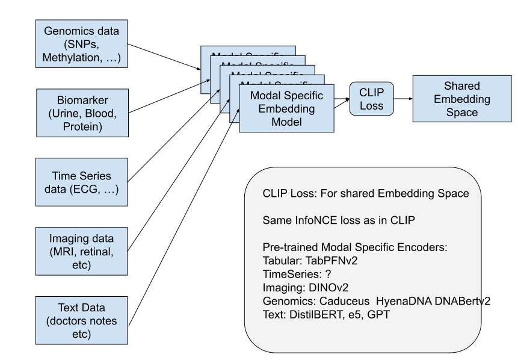

# CLIP
CLIP repo for Bioinformatics data. The goal is to project all types of data into a shared embedding space similar to IntegrA (integrate any omics) but using the contrastive clip loss.

Embedding Space for Text and Image looks something like this:

